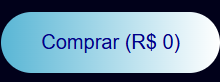
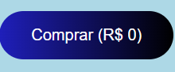
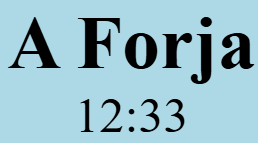
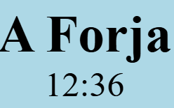
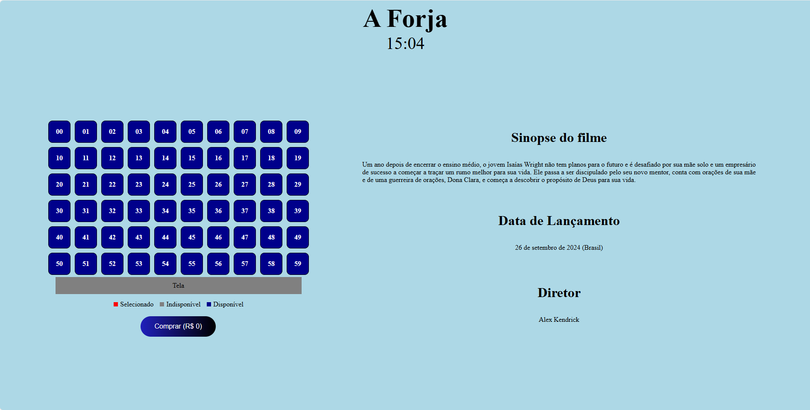
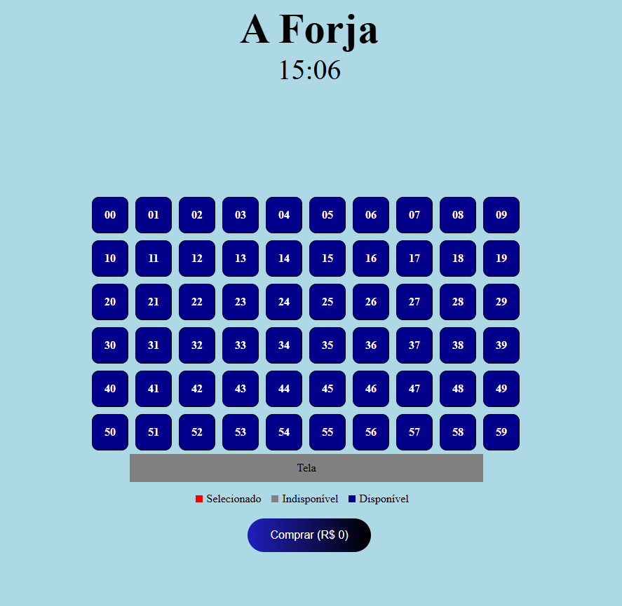
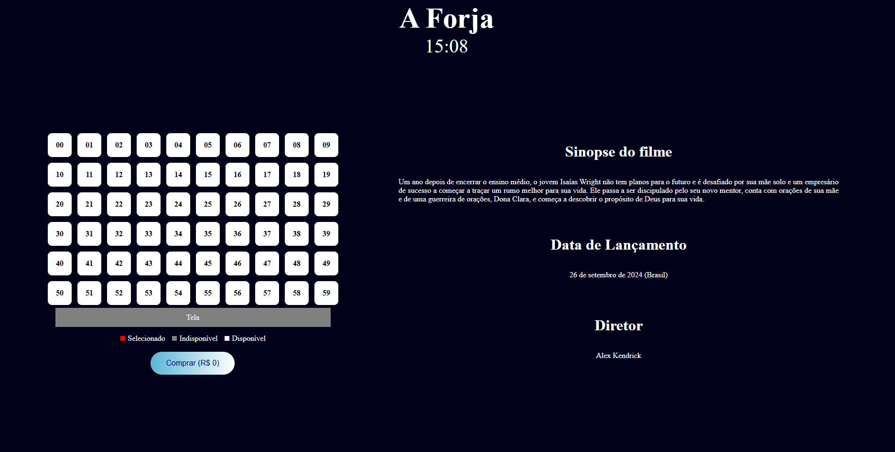
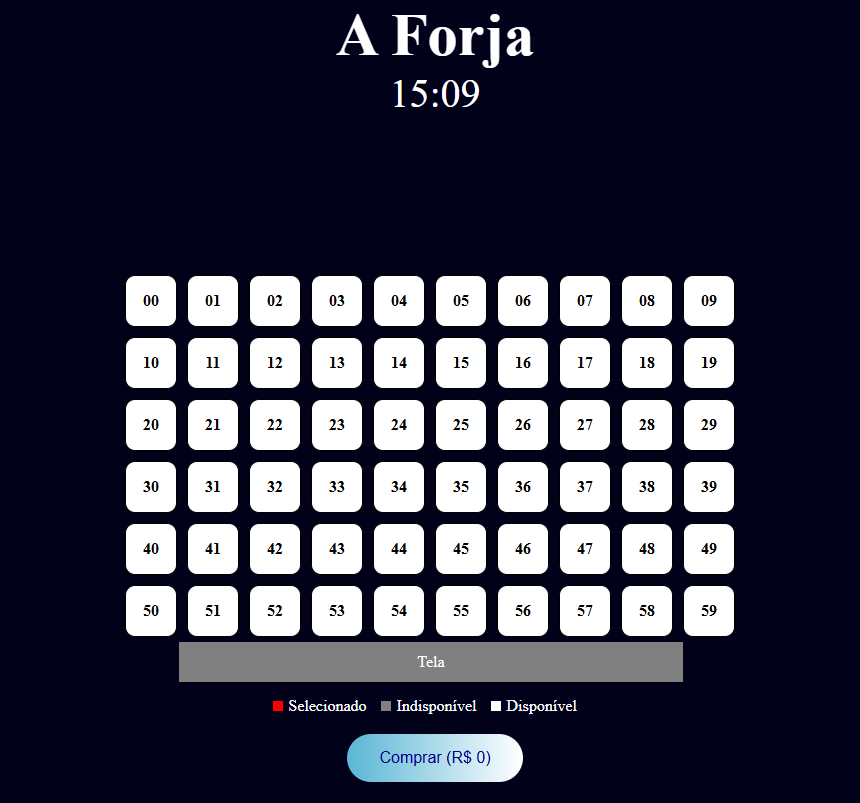

<h1>bernnardo francisco de oliveira Silva 10435832</h1>

<h1 style="font-size:36px; text-align:center;">POC-6 React em Prática , Bernnardo francisco de oliveira silva 10435832</h1>

 
    <h1 class="subtitle">Enunciado</h1>
    

    Implemente a interface a seguir de acordo com os requisitos apresentados. Após o desenvolvimento, o grupo deve criar um README em formato de tutorial, descrevendo passo a passo como desenvolver a solução, desde a criação do projeto até sua versão final.
    

    

    <h1 class="subtitle">Page.js</h1>
    

    A página inicial é responsável por importar os dados do arquivo data.json e estruturar os componentes Header e Content, mais sobre os compoentnes a seguir...

 
    <h1 class="subtitle">Componentes</h1>
    
  
     <a href="#button" style="font-size:16px">Button</a>
     <a href="#content" style="font-size:16px">Content</a>
     <a href="#film" style="font-size:16px">Film</a>
     <a href="#header" style="font-size:16px">Header</a>
     <a href="#room" style="font-size:16px">Room</a>
     <a href="#seat" style="font-size:16px">Seat</a>
    

    <h2 class="subtitle">Button</h2>
    

        Esse componente possui um Css modular responsável por estilizar o botão e pela responsividade.  
        O componente exporta uma função que recebe um children (texto de dentro do botão) e uma função, que será utilizada no atributo onClick do botão.
        Por não ter estado, ele é renderizado no lado do servidor.
    

        
        import styles from './Button.module.css';
        export default function Button({ children, func }) {
            return (
                <button onClick={func} className={styles.button}>{children}</button>
            );
        }

    O Css modular do componente além de estilizar o componente, é responsável por garatir a responsividade do componente, mudando sua posição e cor dependendo das preferências do usuário e tamanho de tela

    

<h1 style="text-align: center;">Tema Escuro</h1>

<h1 style="text-align: center;">Tema Claro</h1>

    <h2 class="subtitle">Content</h2>
    

    O componente Content é responsável por apenas estruturar os componentes "Room" e "Film" dentro de uma tag main estilizado pela classe film do css global.
    Ele recebe a variável data, que representa o conteúdo do data.json e envia para os componentes.
    Por não ter estado, ele é renderizado no lado do servidor.
    

    import Room from "./Room";
    import Film from "./Film";
    export default function Content({ data }) {
    return (
        <main className="film">
         <Room data={data} />
         <Film data={data} />
        </main>
        );
    }

    <h2 class="subtitle">Film</h2>
    
O componente Film é responsável pela descrição do filme que aparece na direita ou abaixo da representação da sala, dependendo do tamanho da tela do usuário.
    Ele recebe os dados do data.json que foi enviado pelo componente Content, e os apresenta na tela.
    Por não ter estado, ele é renderizado no lado do servidor.
    

    export default function Film({ data }) {
    return (
      

        <h2 className="subtitle">Sinopse do filme</h2>
        

          {data.sinopse}
        

        <h3 className="subtitle">Data de Lançamento</h3>
        

          {data.dataLancamento}
        

        <h4 className="subtitle">Diretor</h4>
        

            {data.direcao}
          

      

        );
    }

    <h2 class="subtitle">Header</h2>
    
Esse componente é responsável pelo título do filme e pelo relógio do topo da página.  
    O título foi importado da variável data, que são os dados do data.json.  
    O relógio foi criado a partir do componente Clock que foi importado do pacote "react-live-clock": "^6.1.23-beta".  
    Por conta do estado do tempo do relógio, o componente é renderizado no lado do cliente.
    

    "use client";
    import styles from "./Header.module.css";
    import Clock from "react-live-clock";

    export default function Header({ data }) {
      return (
        

          <h1>
            {data.titulo}
          </h1>
          <Clock format={"HH:mm"} ticking={true} timezone={"America/Sao_Paulo"} className={styles.clock} />
        

      );
    }

    <h2 class="subtitle">Room</h2>
    

        O componente Room é responsável por renderizar a sala de cinema com os assentos disponíveis para seleção e compra.   Ele utiliza o estado para gerenciar os assentos selecionados e o preço total da compra.  
O componente recebe a variável "data", que representa o conteúdo do `data.json` e contém informações como o preço dos assentos.

    - `defaultPrice` é a constante que armazena o preço padrão dos assentos.
    - `selectedSeats` é o estado que armazena os assentos selecionados.
    - `totalPrice` é o estado que armazena o preço total da compra.

A função `renderSeats` é responsável por renderizar as linhas e colunas de assentos, utilizando o componente `Seat` para cada assento.

A função `handleSeatSelect` é chamada quando um assento é selecionado ou desmarcado, atualizando o estado `selectedSeats` e o `totalPrice`.

A função `buySeat` é chamada quando o botão de compra é clicado, marcando os assentos selecionados como comprados e resetando o preço total.

O componente é renderizado no lado do cliente devido ao uso de estado e funções de interação.

    "use client";
    import React, { useState } from "react";
    import styles from "./RoomSeat.module.css";
    import Seat from "./Seat";
    import Button from "./Button";

    export default function Room({ data }) {
      const defaultPrice = data.preco;
      const [selectedSeats, setSelectedSeats] = useState({});
      const [totalPrice, setTotalPrice] = useState(0);
      const renderSeats = (rows, seats) => {
        return [...Array(rows)].map((_, rowIndex) => (
          

            {[...Array(seats)].map((_, seatIndex) => {
              const seatKey = `${rowIndex}-${seatIndex}`;
              const seatStatus = selectedSeats[seatKey] || {};
              return (
                <Seat
                  key={seatIndex}
                  purchased={seatStatus.purchased || false}
                  selected={seatStatus.selected || false}
                  onSelect={(isSelected) =>
                    handleSeatSelect(rowIndex, seatIndex, isSelected)
                  }
                  number={`${rowIndex}${seatIndex}`}
                />
              );
            })}
          

        ));
      };

      const handleSeatSelect = (rowIndex, seatIndex, isSelected) => {
        const seatKey = `${rowIndex}-${seatIndex}`;
        const currentSeat = selectedSeats[seatKey] || {};
        if (currentSeat.purchased) {
          return;
        }

        setSelectedSeats((prevState) => ({
          ...prevState,
          [seatKey]: {
            ...prevState[seatKey],
            selected: isSelected,
            available: !isSelected,
          },
        }));

        setTotalPrice((prevPrice) =>
          isSelected ? prevPrice + defaultPrice : prevPrice - defaultPrice
        );
      };

      const buySeat = () => {
        const selectedSeatKeys = Object.entries(selectedSeats)
          .filter(([_, status]) => status.selected)
          .map(([key]) => key);

        if (selectedSeatKeys.length === 0) {
          alert("Selecione um assento");
          return;
        }

        setSelectedSeats((prevState) => {
          const newState = { ...prevState };
          selectedSeatKeys.forEach((key) => {
            newState[key] = {
              selected: false,
              purchased: true,
            };
          });
          console.log(newState);
          return newState;
        });

        alert("Compra realizada com sucesso!");
        setTotalPrice(0);
      };

      return (
        

          {renderSeats(6, 10)}

          
Tela

          

            

            <label style={{ marginLeft: "5px", marginRight: "15px" }}>
              Selecionado
            </label>

            

            <label style={{ marginLeft: "5px", marginRight: "15px" }}>
              Indisponível
            </label>

            

            <label style={{ marginLeft: "5px" }}>Disponível</label>
          

          <Button func={buySeat}>Comprar (R$ {totalPrice})</Button>
        

      );
    }

    

    <h2 class="subtitle">Seat</h2>
    
O componente seat representa os assentos da sala do cinema. 
    O componente recebe as variáveis (selected, purchased, onSelect, number), onde selected é responsável por atribuir a classe de css modular "selected" que troca a cor do assento para vermelho e quando está como falso, ele volta a cor padrão.  
    - Purchased é a variável que mostra a disponibilidade do assento para compra, ficando na cor cinza e não podendo mais ser clicado, como explicado no componente Room.  
    - onSelect é uma função chamada quando o assento é clicado, sendo responsável por trocar o valor de selected  
    - Number representa o número do assento.
    O componente é renderizado no lado do servidor porque os estados ficam salvos no componente Room
    

    import styles from './RoomSeat.module.css';

    export default function Seat({ selected, purchased, onSelect, number }) {
    const seatClass = `${styles.seat} 
    ${selected ? styles.choosenSeat : ''} 
    ${purchased ? styles.unavailable : ''}`.trim();

    return (
        
 !purchased && onSelect(!selected)}
        >
            {number}
        

    );
    }

## Responsividade

O projeto é responsivo baseado no tamanho da tela do usuário, ou baseado na preferência de tema claro ou escuro.

    <h1 class="subtitle">Tema Claro</h1>

    <h1 class="subtitle">Tema Escuro</h1>

